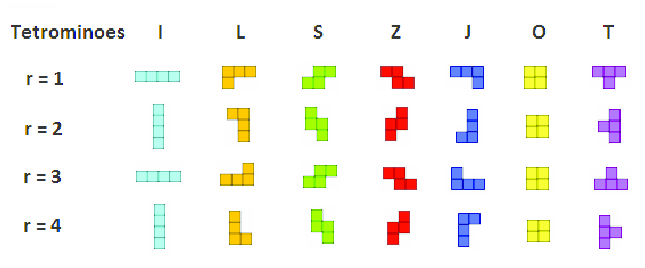
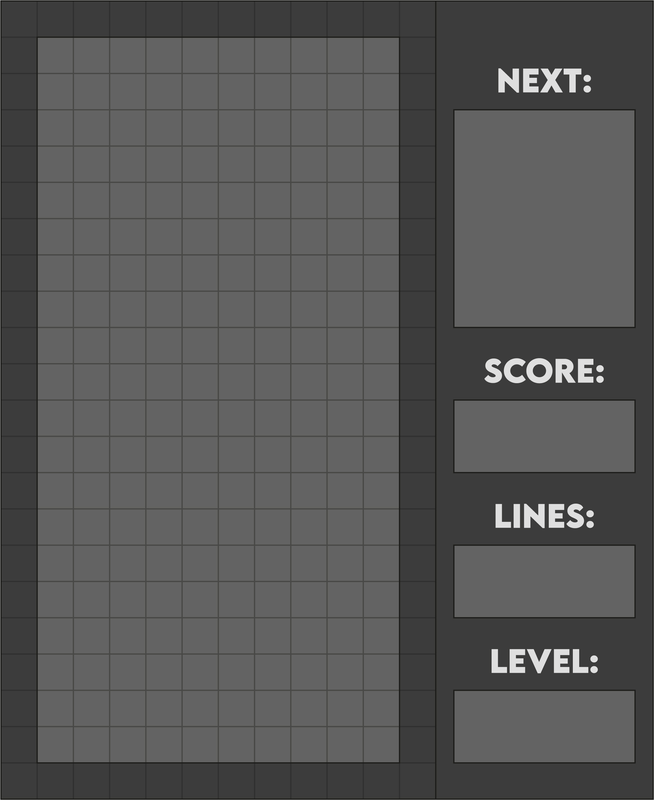

# Tetris en Processing

___

En este proyecto se realizó un tetris usando programación estructurada mediante processing. Tetris es un videojuego popular cuya mecánica está basada en los tetrominos, estas son formas geométricas compuestas de cuatro cuadrados iguales conectados entre sí ortogonalmente. Estos tetrominos van cayendo por el tablero uno a uno, aleatoreamente, y el jugador, con ayuda de su teclado puedo rotar o mover lateralmente estos tetrominos con el objetivo de acomodarlos en la parte inferior del tablero sin dejar espacios vacios, para así, ir eliminando las filas que estén completas y aumentando el puntaje y la dificultad del juego.
A la hora de programar una versión de este juego se deben tener en cuenta los siguientes aspectos:

## Las fichas, sus rotaciones y el tablero:

Ya que cada tetromino es diferente, así como sus colores y sus rotaciones, es importante tenerlos en la memoria de la forma más optimizada posible. En este proyecto se  le asigna un entero a cada rotación del tetromino, este se escoge pasando de la matriz del tetromino a una matriz de 0s y 1s donde 1 representa los cuadrados el tetromino, y así mismo esta mariz para a ser un número binario que nos dará el entero necesario para la representación.
Por ejemplo el tetromino S en su rotación 1 está dado por la matriz:{{011}, {110}, {000}} y su equivalente en binario es 011110000 es decir 240. De esta manera se almacenaron todas las fichas y sus rotaciones en la memoria. Los colores se guardan individualmente para cada tetromino.

Para el tablero se asignó una matriz de 20x10 que es el tamaño de celdas disponibles para los tetrominos,  con valores iniciales null que representan los campos vacios de este y que a medida que los tetrominos llegan a la parte inferior del tablero pasan a ser alguno de los siguientes caracteres: c, n, v, r, a, o, m. Estos caracteres permiten diferenciar los colores en cada celda del tablero y a su vez permiten a las siguientes piezas identificar que esa celda no está vacía como lo veremos más adelante. 

## Caida de las piezas:

## Colisiones:

## Eliminar filas:

## Puntaje:
